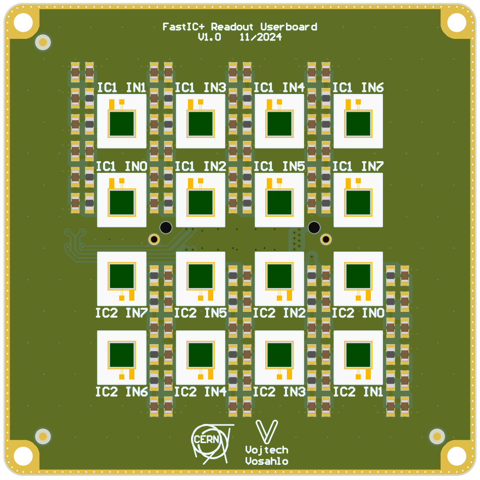
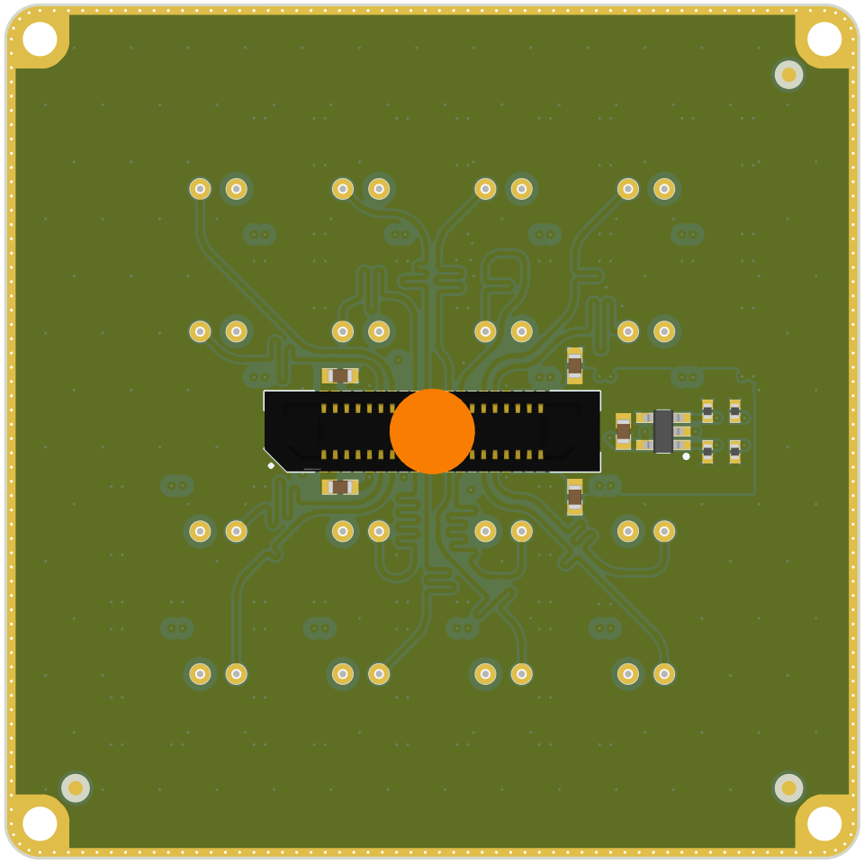

# FastIC+ readout userboard
This repository contains the project files and manufacturing outputs for the FastIC+ readout userboard. The board can either be used with the [FastIC+ readout](https://github.com/WojtaCZ/fastic-readout-hw) as is or used as a template for development of a custom userboard compatible with the FastIC+ readout. 

  
   

## Interface connector
The [ERF8-020-09.0-L-DV-K-TR](https://www.samtec.com/products/erf8-020-09.0-l-dv-k-tr) is used for interfacing with the readout system. The readout system provides a 3.3 V supply to the userboard on pins *40* and *39*. Decoupling capacitors should be added on these pins.

The identification pins *ID0*, *ID1*, *ID2* and *ID3* can be used for simple identification of the userboard by pulling them to 3.3 V or GND with a suitable resistor. The ID = 0b1111 (all pins are pulled high) is reserved to indicate that a I2C EEPROM is present on the board and available for configuration storage. *ID0* and *ID1* are than used for I2C communication with the EEPROM. The minimal EEPROM size is 4 kbit. **Note that the ID = 0b0000 (all pins pulled low) is reserved and cannot be used!**

High voltage for biasing of the sensors is provided by the readout system on pins *1*, *2*, *3* and *4*. Decoupling capacitors should be added on these pins.

The pins *INx_FASTICy* are input pins routed to the FastIC+ input channels. The channels on the readout board are length matched to provide consistent propagation delay for all channels.

  

## Specifications
The following table summarises the electrical specifications of the readout and userboard. These specifications need to be met in order to guarantee propper functionality.

|                                        |   Min   |   Typ   |   Max   |   Unit   |
| -------------------------------------- | :-----: | :-----: | :-----: | :------: | 
| 3.3V voltage                           | 3.15    | 3.30    |  3.45   | V        |
| 3.3V current                           |         |         |  50     | mA       |
| HV voltage                             |         |         |  75     | V        |
| HV current                             |         |         |  5      | mA       |
| Pull resistor value                    | 10      |         |  100    | kOhm     |
| INx_FASTICy propagation delay[^1][^2]  | 200     | 230     |  260    | ps       |

[^1]:
    The delay specified is the sum of the readout PCB propagationdelay (120 ps) and the connector stack (mated connectors) propagation delay (110ps). The propagation delay of the FastIC+ package and the userboard PCB propagation delay is not taken into account. 
[^2]:
    The channels in the provided userboard example are length matched to (142 ps) this the total propagation delay from the sensor to the FastIC+ package pin is the sum of the userboard delay (142 ps) and the propagation delay (230 ps), thus *tpd = 372 ± 30 ps*. The propagation delay of the FastIC+ package and the sensor propagation delay is not taken into account.

## List of compatible EEPROMs

|              Manufacturer              |           Family          |          Example          |
| -------------------------------------- | :-----------------------: | :-----------------------: |
| Mircochip                              | 24AA series               | 24AA04T-I/OT              |

